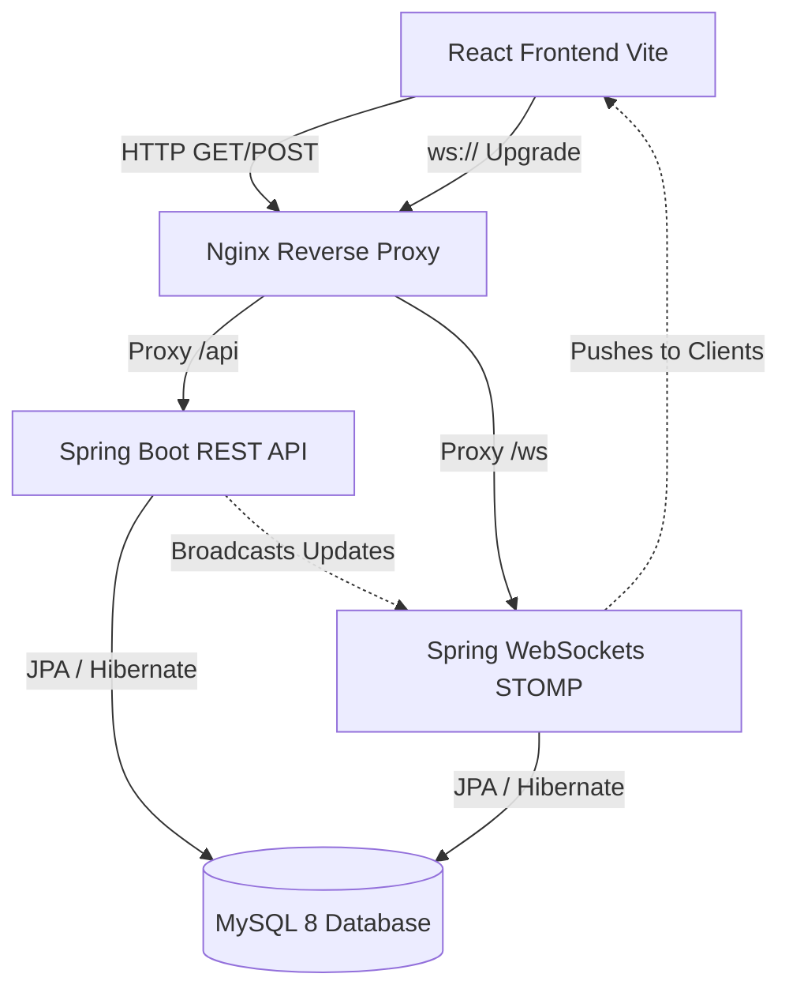

# Smart Workforce Management System

A full-stack, enterprise-grade Workforce Management System designed to streamline task delegation, track employee progress, and analyze team performance in real-time.

Built with a robust **Spring Boot** backend and a beautiful, modern **React (Vite)** frontend, this application features Role-Based Access Control (RBAC), secure JWT authentication with refresh tokens, and real-time WebSockets.

---

## 🚀 Features

- **Role-Based Access Control (RBAC)**: Secure access tailored for `ADMIN`, `MANAGER`, and `EMPLOYEE` roles.
- **Real-Time Updates**: Tasks update live across all connected clients via STOMP WebSockets—no page refresh required.
- **Dashboard Analytics**: Live statistics and charts (built with Recharts) showing task completion rates, trends, and overdue metrics.
- **Task Management Lifecycle**: Create, assign, prioritize, and track the status of tasks (Pending, In Progress, Completed).
- **Secure Authentication**: End-to-end security using rotating JWT Access Tokens and persistent Refresh Tokens stored in MySQL.
- **Modern UI/UX**: A beautiful dark-themed, glassmorphism design built with Tailwind CSS v4 for an ultra-premium feel.
- **DevOps Ready**: Fully containerized with Docker, multi-stage builds, and Nginx reverse proxy. Easily deployable to Vercel, Render, and Aiven.

---

## 🏗️ Architecture & API Flow

### Flow Example: Creating a Task
1. Manager submits form on React Frontend.
2. Axios sends `POST /api/tasks` with JWT Bearer Token.
3. Spring Security validates the JWT in `JwtAuthenticationFilter`.
4. `TaskController` processes the request and saves to MySQL via `TaskRepository`.
5. `TaskService` broadcasts the new task object to `/topic/tasks` via `SimpMessagingTemplate`.
6. Connected employees immediately see the new task appear via their WebSocket subscription.

---

## 🛠️ Tech Stack

### Frontend
- **React 18** (Vite)
- **Tailwind CSS v4** (Utility-first styling, Glassmorphism)
- **Recharts** (Data visualization & analytics)
- **React Router v6** (Protected routing)
- **Axios** (API Client with response interceptors)
- **STOMP.js & SockJS** (WebSockets)

### Backend
- **Java 17** & **Spring Boot 3**
- **Spring Security & JWT** (Authentication & Authorization)
- **Spring Data JPA** (Hibernate)
- **Spring WebSockets** (Real-time broadcasting)
- **MySQL 8.4** (Database)

### DevOps & Cloud
- **Docker & Docker Compose** (Local development)
- **Vercel** (Frontend Hosting)
- **Render** (Backend Hosting)
- **Aiven** (Managed MySQL Database)

---

## ☁️ Cloud Deployment (Vercel & Render)

This repository is configured to easily deploy to free PaaS providers for a live showcase.

### 1. Database (Aiven)
- Create a free MySQL 8 database on Aiven.
- Obtain the Service URI.

### 2. Backend (Render / Railway)
- Connect your GitHub repo to a free Render Web Service.
- Set the Root Directory to `backend` or deploy from root with Docker.
- Add environment variables:
  - `SPRING_DATASOURCE_URL`, `SPRING_DATASOURCE_USERNAME`, `SPRING_DATASOURCE_PASSWORD` (Point to Aiven).
  - `ALLOWED_ORIGINS`: `https://your-frontend.vercel.app` (for CORS).

### 3. Frontend (Vercel)
- Import the repository into Vercel and set the Root Directory to `wms-frontend`.
- Add environment variables:
  - `VITE_API_URL`: `https://your-backend.onrender.com/api`
  - `VITE_WS_URL`: `wss://your-backend.onrender.com/ws`

---

*Developed by Shreyansh Shakya*
